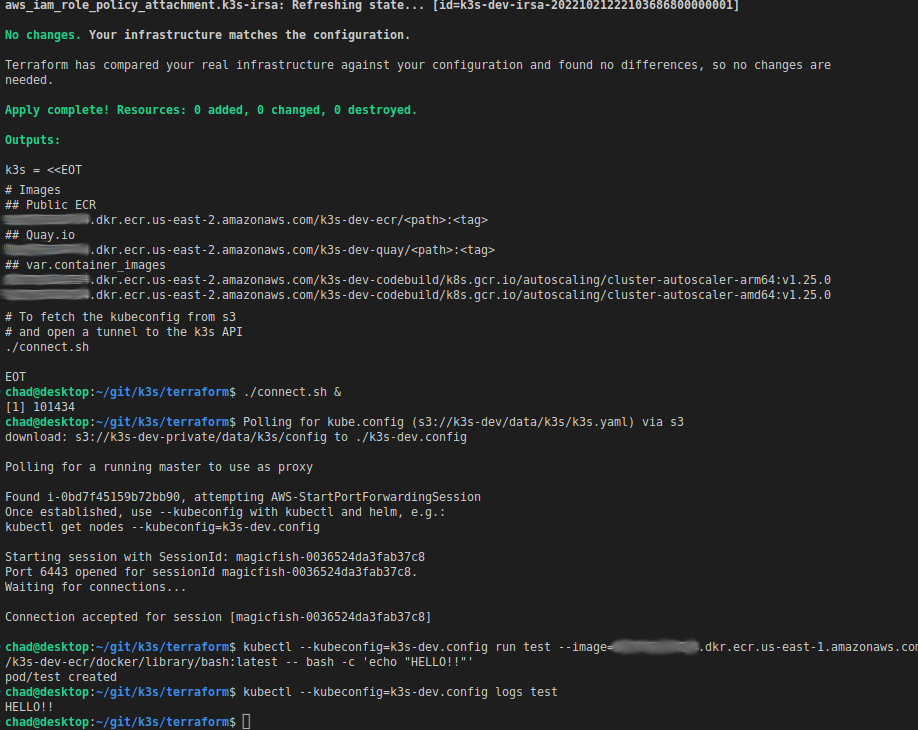

# K3s Cluster on AWS
Deploys a low-cost, scalable, private K3s cluster on AWS.

## Requirements
* aws account, [awscli v2](https://docs.aws.amazon.com/cli/latest/userguide/getting-started-install.html), [ssm plugin](https://docs.aws.amazon.com/systems-manager/latest/userguide/session-manager-working-with-install-plugin.html#install-plugin-linux)
* terraform v1+

## Deploy
```shell
# customize/edit settings.auto.tfvars

# init and apply
terraform init --upgrade
terraform apply
```

## Features
* offline
  * cluster has no direct internet access
  * saves costs on NAT gateways for development
  * lambda fetches external dependencies
  * ecr pull through with [public-ecr](https://gallery.ecr.aws/docker) and [quay.io](https://quay.io/search)
  * optional tf for public access
    * replace `main-vpc.tf` with `main-vpc.tf-with-public`
* independently scalable
  * node groups
  * datastore (RDS postgres)
  * availability zones
* interact with cluster via SSM PortForwardSession
  * script included, see image below
  * works with kubectl, helm, lens, etc.
* strongly enforced encryption
  * 6 independent kms keys (cloudwatch, ec2, lambda, rds, s3, ssm)
  * tailored kms key policies
  * tailored bucket policy / iam policies (ec2, lambda)
* arm, x86, gpu based nodes
  * save cost using ARM-based EC2 instances for master group
* IRSA support
  * public endpoint exposed via s3 bucket
  * oidc data refreshes periodically
  * lambda manages aws identity provider



[Contact Me](https://discord.gg/zmu6GVnPnj)

## TODO
* charts