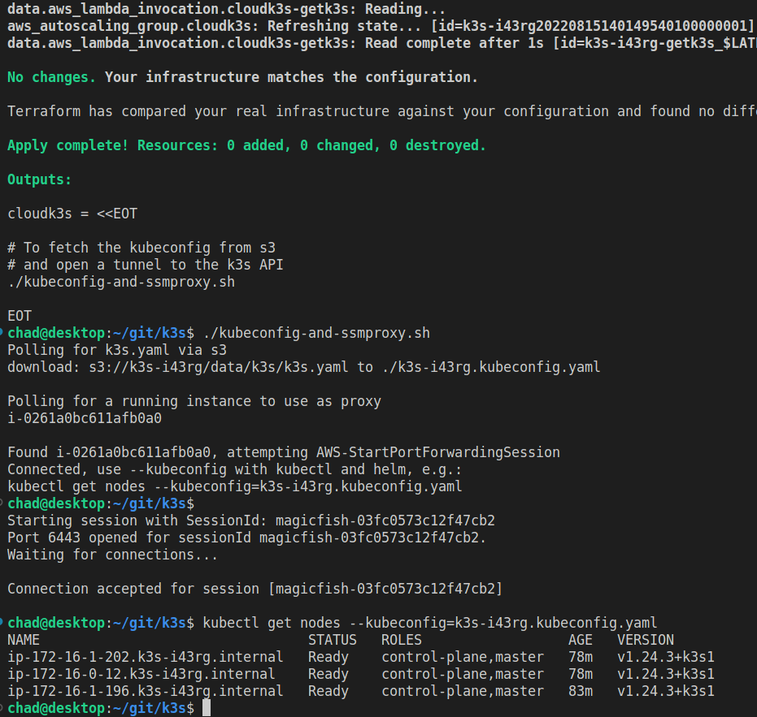

# cloudk3s
Kubernetes in AWS with k3s deployed via terraform. Save costs (compared to EKS) without compromising scalability or features.

## Requirements
* aws account
* [awscli v2](https://docs.aws.amazon.com/cli/latest/userguide/getting-started-install.html)
* [ssm plugin](https://docs.aws.amazon.com/systems-manager/latest/userguide/session-manager-working-with-install-plugin.html#install-plugin-linux)
* [terraform v1+](https://developer.hashicorp.com/terraform/downloads)

## Deploy
```shell
cd terraform/

# customize settings.auto.tfvars

# init and apply
terraform init
terraform apply
```

## Features
* offline or online
  * cluster functions without direct internet access
    * enable egress w/ `var.nat_gateways = true`
    * lambda+ssm bootstrap [k3s' airgap installation](https://docs.k3s.io/installation/airgap)
  * container image mirror via ecr with:
    * [pull-through-cache](https://docs.aws.amazon.com/AmazonECR/latest/userguide/pull-through-cache.html) for images @
      * [public-ecr](https://gallery.ecr.aws/docker)
      * [quay.io](https://quay.io/search)
    * any other public image using codebuild (`var.container_images`)
      * supports multi-arch
      * see `terraform/settings.auto.tfvars => container_images[]`
* multiple scaling configurations
  * create any number of node groups
  * define the following components per node group, including the control-plane
    * node count (min/max)
    * instance type
    * architecture (arm, x86, gpu)
    * local storage
  * datastore (RDS postgres)
  * availability zones
* IRSA (IAM roles for Service Accounts) support
  * OIDC endpoint enrollment via s3 bucket static page
  * lambda manages aws identity provider
  * example: `./terraform/manifests/irsa.yaml` after apply
* interact with cluster API via SSM PortForwardSession
  * post-apply: `./terraform/connect.sh`, see example image
  * works with kubectl, helm, k9s, lens, etc.
* strongly enforced encryption + access management
  * at-rest:
    * 9 independent kms keys (codebuild, cloudwatch, ec2, ecr, lambda, rds, s3, sns, ssm)
    * tailored kms key, bucket, iam, and trust policies
  * in-transit:
    * IPSec via Cilium
    * Cilium network policies
* included charts:
  * aws cloud controller
  * aws-ebs-csi-controller and aws-efs-csi-controller
  * cilium cni w/ base network policies
  * external-dns (req. `var.nat_gateways = true`)

## Known Bugs + Fixes
* `aws-ebs-csi-driver`
  * bug: is incompatible with the k3s CCM (cloud controller manager)
    * k3s CCM labels nodes with values that are incompatible
    * especially `node.kubernetes.io/instance-type` used by `aws-ebs-csi-driver`
    * fix: disabled k3s ccm, replaced with aws ccm
* `aws-efs-csi-driver`
  * bug: official helm chart does not support passing mounts + envvars
    * mounts + envvars are required for non-eks IRSA, e.g: see `./terraform/templates/irsa.yaml.tftpl`
    * fix: granted control-plane nodes' iam instance profile the permissions required for efs
* `aws-load-balancer-controller`
  * bug: nodes (ec2 instances) are not attached to associated nlb target group(s)
    * likely related to cni being non-native (cilium instead of eni)
    * fix: used aws ccm's native lb controller
* `external-dns`
  * bug: use of route53 requires internet egress
    * route53 has no regional endpoints (therefore no vpc endpoint support)
    * fix: added option to enable a nat gateway
  * bug: `kubernetes-sigs/external-dns`' helm chart does not support serviceaccount `automountServiceAccountToken`
    * the token must be mounted for non-eks IRSA, e.g: see `./terraform/templates/irsa.yaml.tftpl`
    * fix: used `bitnami/charts`'s external-dns w/ `.Values.serviceAccount.automountServiceAccountToken: true`
      * this introduces another bug
  * bug: `bitnami/external-dns` container image only supports x86_64
    * node architecture may be arm64
    * fix: used `ghcr.io/zcube/bitnami-compat/external-dns` which supports multi-arch



[Contact Me](https://discord.gg/sB9dUaj9jt)
